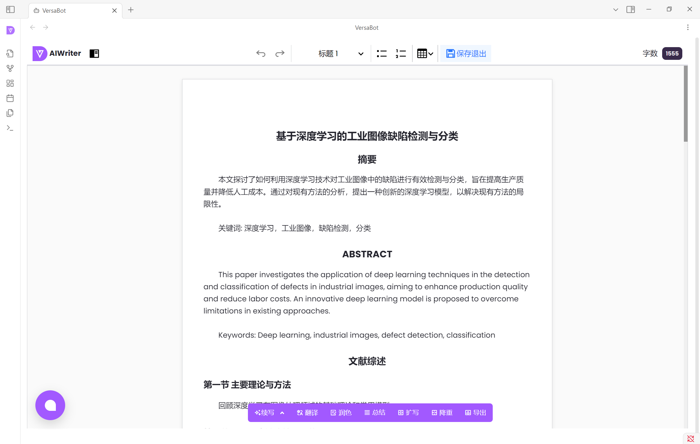

# Obsidian-VersaBot
[[Chinese](https://github.com/uniconnector/Obsidian-VersaBot/blob/main/README.md) | English]

#### Description
# Obsidian Academic Writing Assistant Plugin: Empowering Efficient Academic Creation

In the long journey of academic research, writing high-quality academic papers is the core task for every scholar. However, the processes of sifting through vast amounts of literature, writing literature reviews, polishing language, and integrating PDF materials often consume a significant amount of time and energy. To address these challenges, we have developed the Obsidian Academic Writing Assistant Plugin, an open-source tool designed to provide comprehensive support for academic writing and facilitate the creation of academic achievements.

## Project Introduction

The Obsidian Academic Writing Assistant Plugin is an open-source tool specifically designed for academic creators, deeply integrated into the Obsidian note-taking system. Built on a powerful academic search engine, it combines intelligent literature review generation, language polishing, and PDF session functionalities to meet the diverse needs of academic writing. Whether you are a student just entering the academic field or an experienced researcher, this plugin can become an indispensable assistant in your writing process.

## Key Features

### 1\. Academic Search Engine

- **Precise Retrieval**: Connected to major global academic databases such as Web of Science, Scopus, and PubMed, it supports various search methods, including keywords, authors, and journals, to quickly locate target literature and avoid getting lost in a sea of information.
- **Smart Filtering**: Automatically screens literature based on research topics and preferences, intelligently recommending highly relevant and high-impact literature resources to help you focus on core content and save time on screening.
- **Cross-Database Integration**: Breaks down database barriers and integrates information from different sources in a single interface, supporting one-click export of literature citation formats for seamless integration into the academic writing process. Literature collection has never been easier.

### 2\. Literature Review

- **Automatic Extraction of Key Information**: Utilizing natural language processing technology, it quickly extracts key information from literature, such as core viewpoints, research methods, and experimental results, providing precise materials for writing literature reviews.
- **Smart Generation of Review Framework**: Based on the extracted information, it automatically generates a structured framework for literature reviews, including sections like introduction, current research status, comparison of research methods, and research conclusions. This helps you quickly build a review framework and avoid the dilemma of not knowing where to start.
- **Real-Time Updates and Optimization**: As new literature continues to emerge, the plugin can update the review content in real time, ensuring that your literature review remains the latest and most comprehensive, keeping pace with the cutting edge of academic developments.

### 3\. Polishing

- **Language Style Adaptation**: Tailored to the professionalism of academic writing, it offers multiple language style options, such as formal, concise, and detailed. With one click, you can switch styles to ensure that your language expression meets academic standards.
- **Grammar Correction and Optimization**: Using advanced grammar detection algorithms, it accurately identifies and corrects grammatical errors while optimizing sentence structures to enhance language fluency. This ensures that your paper is expressed clearly and accurately.
- **Professional Term Proofreading**: With an extensive built-in academic terminology library, it automatically checks and corrects the use of professional terms to avoid misunderstandings caused by incorrect terminology, enhancing the professionalism and authority of your paper.

### 4\. PDF Session

- **PDF Import and Annotation**: Supports one-click import of PDF literature and provides convenient annotation tools, such as highlighting, commenting, and underlining. This allows you to easily record key points and ideas while reading, deepening your understanding of the literature.
- **Content Extraction from PDFs**: Quickly extracts text content from PDF literature and supports full-text search and keyword location. This helps you find the information you need without manually flipping through the entire document, improving reading efficiency.
- **Multi-Document Comparative Reading**: Supports opening multiple PDF documents simultaneously for side-by-side comparative reading. This allows you to compare and analyze viewpoints across different literature sources, providing a more comprehensive perspective for your research.

## Usage Scenarios

- **Literature Research Phase**: Quickly collect relevant literature using the academic search engine and organize the current research status with the literature review function. This lays a solid foundation for writing a research proposal or plan.
- **Paper Writing Process**: During writing, use the polishing function to optimize language expression at any time and ensure paper quality. Utilize the PDF session function to review literature materials and supplement arguments as needed.
- **Paper Revision Phase**: Use the polishing function to refine the initial draft and improve language quality. Combine the literature review function to check the accuracy and completeness of literature citations, ensuring the rigor of the paper.

## Open-Source Philosophy and Community Support

As an open-source plugin, we embrace the philosophy of openness and sharing. We welcome developers and academic enthusiasts from around the world to contribute to the project. Whether you are a coding expert, a creative product designer, or a researcher with unique insights into academic writing, you can contribute code, suggest improvements, or share your experience through GitHub. We have also established an active community that regularly holds online and offline events to share academic writing tips, plugin usage experiences, and the latest academic trends, promoting innovative development in academic creation.

The Obsidian Academic Writing Assistant Plugin is committed to creating an efficient and intelligent writing environment for academic creators, making academic writing easier and more enjoyable. Join us and embark on an efficient journey of academic writing, exploring the infinite possibilities of the academic world together!

#### Software Architecture
Using Obsidian plugin extension technology, the site is encapsulated for the second time, and the site style is coordinated with the Obsidian style.

#### Installation

1.  Download the Obsidian software [Download Here](https://github.com/obsidianmd/obsidian-releases/releases/download/v1.8.10/Obsidian-1.8.10.exe)
2.  Open the Obsidian plugin directory.

3.  Copy the plugin to the directory

Download the plugin installation package from the release directory [Download Plugin Installation Package](https://gitee.com/uniconnector_rui_zhang/VersaBot-launcher/raw/master/release/versabot-launcher-1.0.zip)。

4.  Restart Obsidian to view the installed plugin

#### Instructions

1.  Academic Search Engine

2.  Academic Writing Assistant

3.  Polishing Assistant

4.  Literature Assistant

5.  Video Tutorials

#### Contribution

1.  Fork the repository
2.  Create Feat_xxx branch
3.  Commit your code
4.  Create Pull Request

#### Gitee Feature

1.  You can use Readme\_XXX.md to support different languages, such as Readme\_en.md, Readme\_zh.md
2.  Gitee blog [blog.gitee.com](https://blog.gitee.com)
3.  Explore open source project [https://gitee.com/explore](https://gitee.com/explore)
4.  The most valuable open source project [GVP](https://gitee.com/gvp)
5.  The manual of Gitee [https://gitee.com/help](https://gitee.com/help)
6.  The most popular members  [https://gitee.com/gitee-stars/](https://gitee.com/gitee-stars/)
