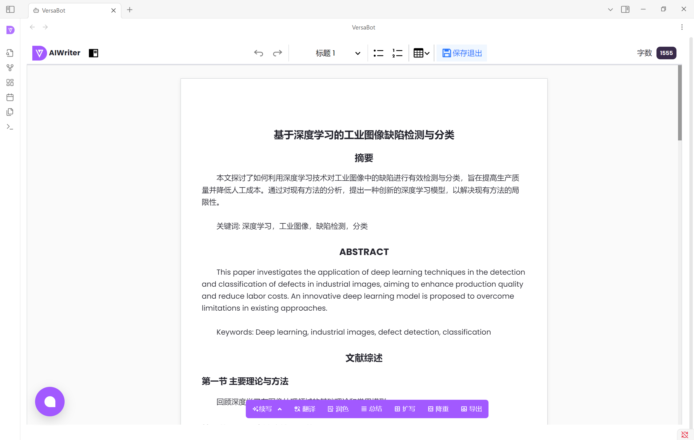
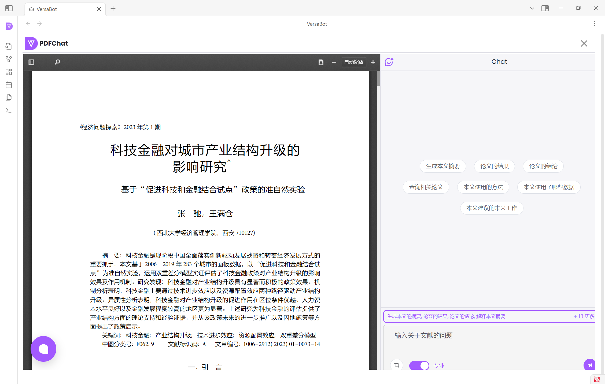

# Obsidian-VersaBot

#### 介绍
# Obsidian学术写作助手插件：开启高效学术创作之旅

在学术研究的漫漫征途中，撰写高质量的学术论文是每一位学者的核心任务。然而，从海量文献中筛选信息、撰写文献综述、润色语言，再到整合PDF资料，这些过程往往耗费大量时间和精力。为此，我们开发了这款开源的Obsidian学术写作助手插件，旨在为学术创作者提供一站式的高效写作支持，助力学术成果的诞生。

#### 软件架构
采用Obsidian插件扩展技术，对站点进行二次封装，并将站点风格与Obsidian风格进行协调一致。

#### 安装教程

1.  下载Obsidian软件 [点击下载](https://github.com/obsidianmd/obsidian-releases/releases/download/v1.8.10/Obsidian-1.8.10.exe)
2.  打开Obsidian插件目录

3.  拷贝插件到目录

下载插件release目录中的安装包[点击下载插件安装包](https://gitee.com/uniconnector_rui_zhang/VersaBot-launcher/raw/master/release/versabot-launcher-1.0.zip)后，解压到插件目录。

4.  重启Obsidian，查看安装后的插件

#### 使用说明

1.  学术搜索引擎

2.  学术写作助手

3.  润色助手

4.  文献助手

5.  视频教程

#### 参与贡献

1.  Fork 本仓库
2.  新建 Feat_xxx 分支
3.  提交代码
4.  新建 Pull Request

#### 特技

1.  使用 Readme\_XXX.md 来支持不同的语言，例如 Readme\_en.md, Readme\_zh.md
2.  Gitee 官方博客 [blog.gitee.com](https://blog.gitee.com)
3.  你可以 [https://gitee.com/explore](https://gitee.com/explore) 这个地址来了解 Gitee 上的优秀开源项目
4.  [GVP](https://gitee.com/gvp) 全称是 Gitee 最有价值开源项目，是综合评定出的优秀开源项目
5.  Gitee 官方提供的使用手册 [https://gitee.com/help](https://gitee.com/help)
6.  Gitee 封面人物是一档用来展示 Gitee 会员风采的栏目 [https://gitee.com/gitee-stars/](https://gitee.com/gitee-stars/)
